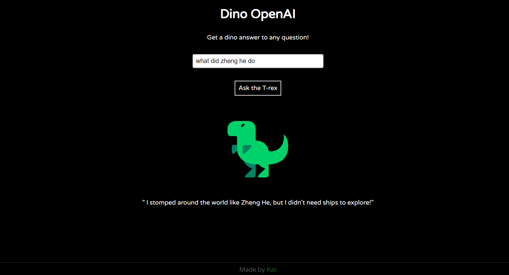

# Dino OpenAI

## <a href="https://dino-ai.netlify.app/">🏠 Live Site</a>

This is a simple app using the <a href="https://platform.openai.com/docs/api-reference/">OpenAI API</a> to give cute dino answers to user inputs.

## Features

- Responsive
- Switch between t-rex and sauropod image/personality by tapping/clicking
- The tone of the answers matches the selected dino

## Technologies

